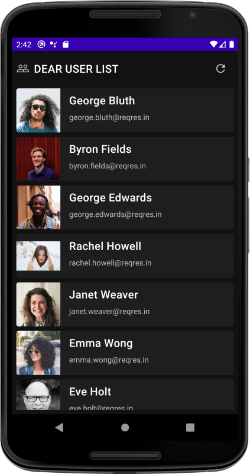
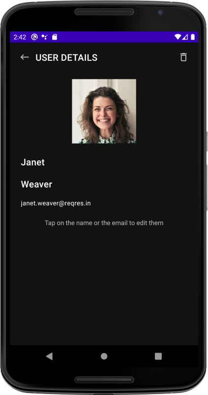

# Приложение mobtest

1. Получение коллекции пользователей
2. Обработка ответа с сервера и валидация полученной коллекции
3. Сохранение коллекции пользователей в базе данных
4. Отображение пользователей из базы данных в список в виде карточек
5. При нажатии на элемент списка – показывать в окне (Fragment) подробную информацию по выбранному пользователю
6. Редактирование данных отдельного пользователя (только в локальной базе данных)
7. Удаление пользователей (только в локальной базе данных)
8. Обновление списка пользователей с сервера

* Unit-тесты
* Кэширование промежуточных данных
* Логирование выполненых операций
* Анимация пользовательских представлений

Язык программирования – Kotlin
Архитектура приложения – MVP или MVVM

* RxJava2/Coroutines
* Room
* Retrofit2
* Picasso/Coil/Glide
